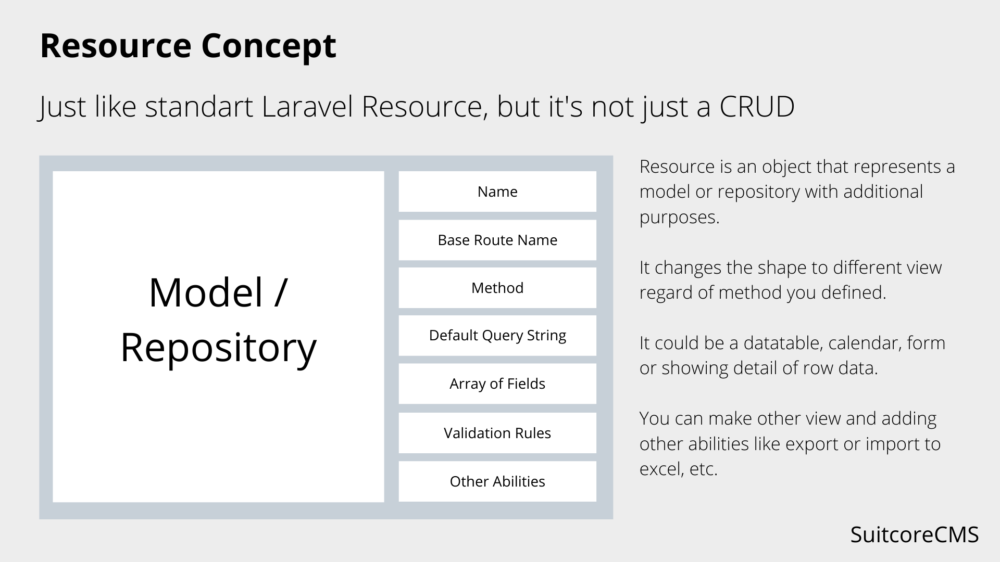
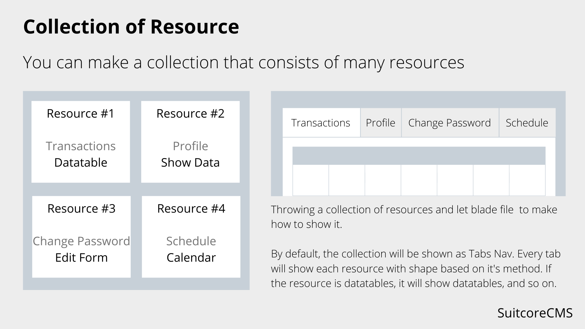
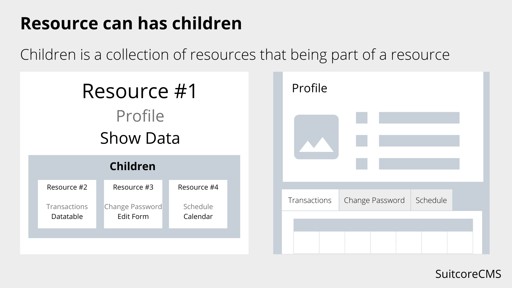
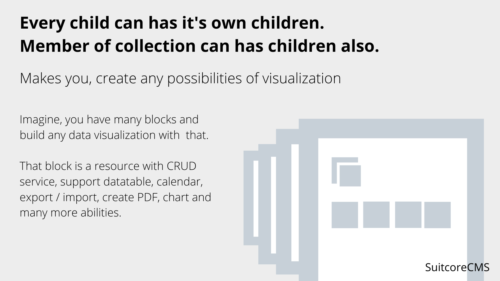

# SuitcoreCMS
You can use SuitcoreCMS side by side with your other CMS package.

## Concepts





## Dependencies
Make sure, you have included this dependencies into your composer before using SuitcoreCMS. 
Do `composer require` to accomplish that.
- [yajra/laravel-datatables-oracle](https://github.com/yajra/laravel-datatables)
- [yajra/laravel-datatables-html](https://github.com/yajra/laravel-datatables)
- [spatie/laravel-medialibrary](https://github.com/spatie/laravel-medialibrary)
- [proengsoft/laravel-jsvalidation](https://github.com/proengsoft/laravel-jsvalidation)
- [cviebrock/eloquent-sluggable](https://github.com/cviebrock/eloquent-sluggable)
- [maatwebsite/excel](https://github.com/Maatwebsite/Laravel-Excel)
- [spatie/laravel-permission](https://github.com/spatie/laravel-permission)
- [spatie/laravel-activitylog](https://github.com/spatie/laravel-activitylog)

With this command :
```shell
composer require yajra/laravel-datatables-oracle yajra/laravel-datatables-html spatie/laravel-medialibrary proengsoft/laravel-jsvalidation cviebrock/eloquent-sluggable maatwebsite/excel spatie/laravel-permission spatie/laravel-activitylog
```

## How To Install
- After installing laravel.
- Go to project directory
```shell
cd your-project-directory-location
```
- Clone SuitcoreCMS repository
```shell
git clone git@gitlab.com:mrofi/suitcorecms.git
```
- Add this line to file `composer.json` in autoload > psr-4 section :
```json
"Suitcorecms\\": "suitcorecms/src/"
```
- Add this line to file `config/app.php`
```php
Suitcorecms\Providers\SuitcorecmsServiceProvider::class,
```
- Do composer autoload to load after updating composer.json file
```shell
composer dump-autoload
```
- Expose config files with artisan magic. We have 2 config files, suitcorecms.php and suitcoresite.php
```shell
php artisan vendor:publish --provider=Suitcorecms\Providers\SuitcorecmsServiceProvider
```

## Installing Theme
- clone from theme repository
```shell
git clone git@gitlab.com:mrofi/suitcorecms-themes.git
```
- For example, you choose theme1, then make a symlink refer to folder ./suitcorecms/themes/theme1
```shell
cd your-project-directory-location/suitcorecms/themes
ln -s ../../suitcorecms-themes/theme1 .
```
- in file config/suitcorecms.php, set theme1 as theme :
```php
'theme' => env('CMS_THEME', 'theme1'),
```
- Copy all theme assets or use symlink instead from themes folder to public/backend_assets. Example :
```shell
cd your-project-directory-location/public
ln -s ../suitcorecms-themes/theme1/assets backend_assets
```

## CMS Route
Create a route file to write all your cms routes. Dont forget, set the file path to `config/suitcorecms.php`. 

Example: you create a file routes/cms.php. Uncomment `'routes' => base_path('routes/cms.php')` in `config/suitcorecms.php`.

SuitcoreCMS comes with it's own Route class that has special treatment for your Controller.
```php
// routes/cms.php

use Suitcorecms\Cms\Route as CmsRoute;

CmsRoute::resource('articles', 'ArticleController');
// ...
CmsRoute::resource('foo', 'FooController');
```

By default, all cms controllers are under namespace `App\Http\Controllers\Cms`. It's defined in config `suitcorecms.namespace`. You can change it by your own namespace.

In `config/suitcorecms.php` there are pre-defined links that attach with your link route.

See :
```php
// config/suitcorecms.php

'Dashboard' => [
    'route'   => 'cms.index',
    'icon'    => 'flaticon-home',
    'descend' => false,
],
```

You just have to add a new route, named as `cms.index`, put in your `routes/cms.php` file.

As simple as :
```php
// routes/cms.php

Route::get('/', 'DashboardController')->name('cms.index');

// or 

// use Suitcorecms\Cms\Route as CmsRoute;
//
// CmsRoute::get('/', 'DashboardController')->name('cms.index');

```


## CMS Guard
in config `suitcorecms` file, we have set your middleware that use guard, named as `cms`. 

If you like to use, your own guard name, you can change it ini config `suitcorecms.guard`.

Or if you want create new guard with name `cms` you can update your `config/auth.php` file :
```php
    'guards' => [
        ...
        'cms' => [
            'driver'   => 'session',
            'provider' => 'admins',
        ],
        ...
    ],


    'providers' => [
        ...
        'admins' => [
            'driver' => 'eloquent',
            'model'  => App\Models\Admin::class,
        ],
        ...
    ],
```

## CMS Auth
After registering new guard, then you can define you authentication in your cms.

In `Auth\LoginController` add trait `use Suitcorecms\Authentications\AuthenticationTrait;`

In file `routes/web.php` add this code :
```php
// routes/web.php

if (! defined('CMS_PREFIXURL')) {
    define('CMS_PREFIXURL', config('suitcorecms.prefix_url'));
}

Route::middleware(['guest:cms'])->group(function () {
    // CMS Auth
    Route::get(CMS_PREFIXURL.'/login', 'Auth\LoginController@cmsLoginForm')->name('cms.login');
    Route::post(CMS_PREFIXURL.'/login', 'Auth\LoginController@cmsLogin')->name('cms.login.login');
});

Route::middleware(['auth:cms'])->group(function () {
    Route::get(CMS_PREFIXURL.'/logout', 'Auth\LoginController@cmsLogout')->name('cms.logout');
});

```

From that code we can see a route, name as `cms.index`, that is the default point when you logged successfully.

All right, next we have to setup redirection if user not login yet.

In file `app/Http/Middleware/Authenticate.php`

```php
protected function redirectTo($request)
{
    if (! $request->expectsJson()) {
        return route('cms.login');
    }
}
```

Next, we have to update redirection after successfully login.

You can try this approach. In file `app/Http/Middleware/RedirectIfAuthenticated.php`

```php
public function handle($request, Closure $next, $guard = null)
{
    if ($guard) {
        if (Auth::guard($guard)->check()) {
            return $guard == 'cms' ? $this->redirectCms() : $this->redirectWeb();
        }
    } else {
        if (Auth::guard('web')->check()) {
            return $this->redirectWeb();
        }

        if (Auth::guard('cms')->check()) {
            return $this->redirectCms();
        }
    }

    return $next($request);
}

protected function redirectWeb()
{
    return redirect('/');
}

protected function redirectCms()
{
    return redirect()->route('cms.index');
}
```
